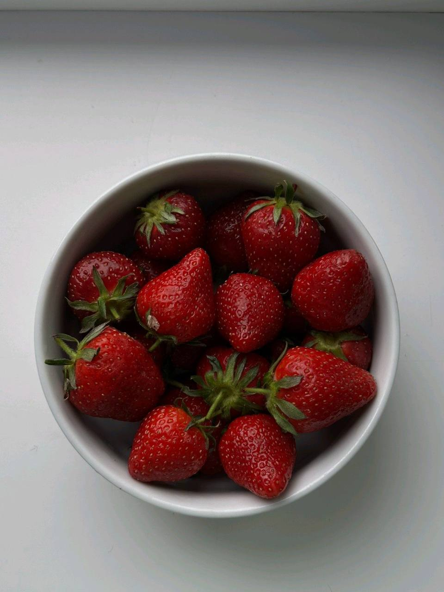
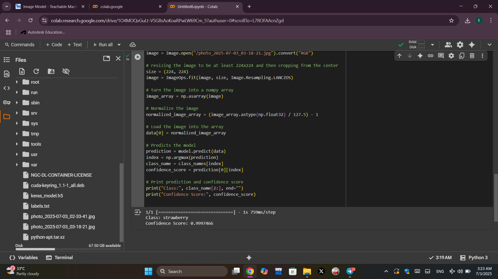

# teachable-machine
This project demonstrates how to build a simple image classifier using Teachable Machine and Google Colab.
The model is trained on at least two categories of images, exported in Keras (.h5) format, and used in a Python-based Colab notebook to predict the class of a new input image.
# steps to project:
# 1-Training the Model with Teachable Machine
Choose Image Project → Standard Image Model
Create two image classes, for example:  Strawberry and mango 
 Upload several images for each class
 Click on Train Model to start training
 Once training is complete, click Export Model → select TensorFlow → Keras
 Download and extract the exported files
You will need the following:
keras_model.h5
 labels.txt
 # 2-Running the Model in Google Colab
 Open Google Colab (https://colab.research.google.com/)
 Create a new notebook or open an existing one (image_classification.ipynb)
 Upload the following files:
 keras_model.h5
 labels.txt
 An image to test
 # 3- lnstall Required Libraries
 !pip install tensorflow==2.12.1
 # 4- Run the Prediction Code 
 # 5- Output 
 The model successfully processed and predicted its class. 
  
